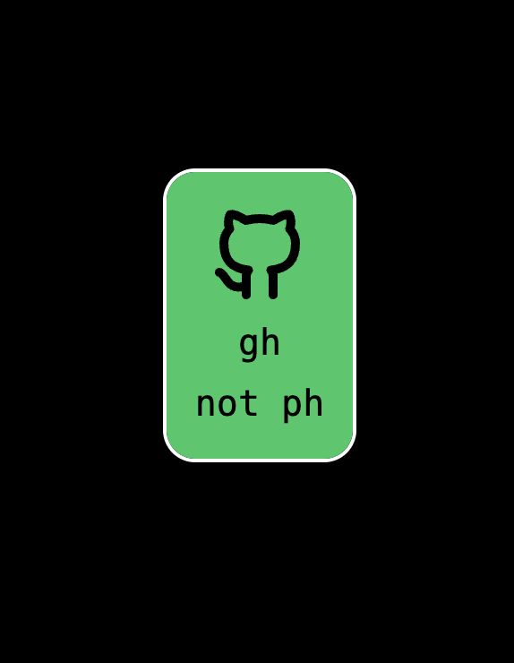

# Library of Components for Generating Non-Interactive Pages/Cards/Files/Content

## Components
* [x] Container
* [x] Text
  - [x] As text (in HTML `<div>`)
  - [x] As link (HTML only, `<a>`)
* [x] Icon

## Available Renders
* [x] HTML (custom implementation)
* [ ] PNG (conversion from SVG)
* [ ] PDF (Skia)
* [ ] SVG (Skia)
* [ ] Leptos

## Goals
- Provide the minimal required support for renderer-specific features
- Ensure maximum compatibility of element properties across all renderers
- Offer a minimally comfortable set of components

## Non-Goals
- Full support for all available properties in all renderers
- Interactivity (e.g., CSS animations)
- Script support for HTML


## Example (HTML)
```rust
use zen_rs::{
    aspects::Align, components::{github::github_outlined, h::mono_text_xl, Components}, layouts::html::HtmlBuilder, vstack
};

fn main() {
    let gp = gh_not_ph();
    let html = HtmlBuilder::default().component(gp).build_as_html();
    std::fs::write("gh_not_ph.html", html).unwrap();
}

fn gh_not_ph() -> impl Into<Components> {
    vstack((
        vstack((
            vstack((
                github_outlined(),
                mono_text_xl("gh"),
                mono_text_xl("not ph"),
            ))
            .background_color((30, 200, 100, 100))
            .gap(4)
            .padding(16)
            .align_content(zen_rs::aspects::Align::Center)
            .flex(),))
            .flex()
            .border_size_t(2)
            .border_size_b(2)
            .border_color((255, 255, 255, 100))
            .border_radius(18),
        ))
        .flex()
        .width_full()
        .height_full()
        .align_items(Align::Center)
        .align_content(Align::Center)
        .background_color((0, 0, 0, 100))
}
```

that we got



## Contributing
If you would like to contribute, feel free to open an issue in the repository.

## License
This project is licensed under the MIT License.
